# Data Science for Novel Coronavirus


## 1. Background introduction:
2019 Novel Coronavirus (COVID-19) has infected more than 1 million people in the
world. We want to do something against this pestilence by using what we have learnt.
This datasets consists of 11 CSV files from the KCDC (Korea Centers for Disease Control & Prevention), a structured
dataset based on the report materials of KCDC and local governments was provided by Korean researchers.

## 2. Data Analysis
### 2.1 Data Statistics and Visualization
#### 2.1.1 Data Preprocessing 


```python
# needed imports
import pandas as pd
import numpy as np
import seaborn as sns
import pandas as pd
from sklearn import manifold
import numpy as np
from sklearn.linear_model import LassoLarsCV
from sklearn.ensemble import GradientBoostingRegressor
from sklearn.model_selection import train_test_split
from sklearn.linear_model import LinearRegression
from sklearn.metrics import r2_score
from sklearn.linear_model import Ridge,RidgeCV  
from sklearn.metrics import mean_squared_error
from matplotlib import pyplot as plt
from scipy.cluster.hierarchy import fcluster
from scipy.cluster.hierarchy import dendrogram, linkage
from scipy.spatial import distance
from sklearn.cluster import KMeans  
from sklearn import manifold
from sklearn.decomposition import PCA
```


```python
PatientInfo = pd.read_csv('PatientInfo.csv')
PatientInfo.head(5)
```


<div>
<style scoped>
    .dataframe tbody tr th:only-of-type {
        vertical-align: middle;
    }

    .dataframe tbody tr th {
        vertical-align: top;
    }
    
    .dataframe thead th {
        text-align: right;
    }
</style>
<table border="1" class="dataframe">
  <thead>
    <tr style="text-align: right;">
      <th></th>
      <th>patient_id</th>
      <th>global_num</th>
      <th>sex</th>
      <th>birth_year</th>
      <th>age</th>
      <th>country</th>
      <th>province</th>
      <th>city</th>
      <th>disease</th>
      <th>infection_case</th>
      <th>infection_order</th>
      <th>infected_by</th>
      <th>contact_number</th>
      <th>symptom_onset_date</th>
      <th>confirmed_date</th>
      <th>released_date</th>
      <th>deceased_date</th>
      <th>state</th>
    </tr>
  </thead>
  <tbody>
    <tr>
      <th>0</th>
      <td>1000000001</td>
      <td>2.0</td>
      <td>male</td>
      <td>1964.0</td>
      <td>50s</td>
      <td>Korea</td>
      <td>Seoul</td>
      <td>Gangseo-gu</td>
      <td>NaN</td>
      <td>overseas inflow</td>
      <td>1.0</td>
      <td>NaN</td>
      <td>75.0</td>
      <td>2020-01-22</td>
      <td>2020-01-23</td>
      <td>2020-02-05</td>
      <td>NaN</td>
      <td>released</td>
    </tr>
    <tr>
      <th>1</th>
      <td>1000000002</td>
      <td>5.0</td>
      <td>male</td>
      <td>1987.0</td>
      <td>30s</td>
      <td>Korea</td>
      <td>Seoul</td>
      <td>Jungnang-gu</td>
      <td>NaN</td>
      <td>overseas inflow</td>
      <td>1.0</td>
      <td>NaN</td>
      <td>31.0</td>
      <td>NaN</td>
      <td>2020-01-30</td>
      <td>2020-03-02</td>
      <td>NaN</td>
      <td>released</td>
    </tr>
    <tr>
      <th>2</th>
      <td>1000000003</td>
      <td>6.0</td>
      <td>male</td>
      <td>1964.0</td>
      <td>50s</td>
      <td>Korea</td>
      <td>Seoul</td>
      <td>Jongno-gu</td>
      <td>NaN</td>
      <td>contact with patient</td>
      <td>2.0</td>
      <td>2.002000e+09</td>
      <td>17.0</td>
      <td>NaN</td>
      <td>2020-01-30</td>
      <td>2020-02-19</td>
      <td>NaN</td>
      <td>released</td>
    </tr>
    <tr>
      <th>3</th>
      <td>1000000004</td>
      <td>7.0</td>
      <td>male</td>
      <td>1991.0</td>
      <td>20s</td>
      <td>Korea</td>
      <td>Seoul</td>
      <td>Mapo-gu</td>
      <td>NaN</td>
      <td>overseas inflow</td>
      <td>1.0</td>
      <td>NaN</td>
      <td>9.0</td>
      <td>2020-01-26</td>
      <td>2020-01-30</td>
      <td>2020-02-15</td>
      <td>NaN</td>
      <td>released</td>
    </tr>
    <tr>
      <th>4</th>
      <td>1000000005</td>
      <td>9.0</td>
      <td>female</td>
      <td>1992.0</td>
      <td>20s</td>
      <td>Korea</td>
      <td>Seoul</td>
      <td>Seongbuk-gu</td>
      <td>NaN</td>
      <td>contact with patient</td>
      <td>2.0</td>
      <td>1.000000e+09</td>
      <td>2.0</td>
      <td>NaN</td>
      <td>2020-01-31</td>
      <td>2020-02-24</td>
      <td>NaN</td>
      <td>released</td>
    </tr>
  </tbody>
</table>
</div>


1. Using the method duplicated in Pandas to detect duplicate values in the dataset


```python
PatientInfo[PatientInfo.duplicated()] 
```


<div>
<style scoped>
    .dataframe tbody tr th:only-of-type {
        vertical-align: middle;
    }

    .dataframe tbody tr th {
        vertical-align: top;
    }
    
    .dataframe thead th {
        text-align: right;
    }
</style>
<table border="1" class="dataframe">
  <thead>
    <tr style="text-align: right;">
      <th></th>
      <th>patient_id</th>
      <th>global_num</th>
      <th>sex</th>
      <th>birth_year</th>
      <th>age</th>
      <th>country</th>
      <th>province</th>
      <th>city</th>
      <th>disease</th>
      <th>infection_case</th>
      <th>infection_order</th>
      <th>infected_by</th>
      <th>contact_number</th>
      <th>symptom_onset_date</th>
      <th>confirmed_date</th>
      <th>released_date</th>
      <th>deceased_date</th>
      <th>state</th>
    </tr>
  </thead>
  <tbody>
  </tbody>
</table>
</div>


The result shows there is no duplicate values.
2. See if there are missing values for each attribute of the data set


```python
index_array = np.sum(PatientInfo.isnull() == True, axis=0)
print(index_array)
print(PatientInfo.shape[0])
```

    patient_id               0
    global_num            1160
    sex                     94
    birth_year             464
    age                    105
    country                 90
    province                 0
    city                    76
    disease               3110
    infection_case         819
    infection_order       3097
    infected_by           2393
    contact_number        2539
    symptom_onset_date    2682
    confirmed_date           0
    released_date         2147
    deceased_date         3072
    state                    0
    dtype: int64
    3128


There are 3128 rows in the dataset PatientInfo.csv
I notice that there are many miss values in many colums, and I decide first observe characteristics of the data by visualization and then deal with the miss value.

3. Outlier detecting


```python
PatientInfo.describe().astype(np.int64).T
```


<div>
<style scoped>
    .dataframe tbody tr th:only-of-type {
        vertical-align: middle;
    }

    .dataframe tbody tr th {
        vertical-align: top;
    }
    
    .dataframe thead th {
        text-align: right;
    }
</style>
<table border="1" class="dataframe">
  <thead>
    <tr style="text-align: right;">
      <th></th>
      <th>count</th>
      <th>mean</th>
      <th>std</th>
      <th>min</th>
      <th>25%</th>
      <th>50%</th>
      <th>75%</th>
      <th>max</th>
    </tr>
  </thead>
  <tbody>
    <tr>
      <th>patient_id</th>
      <td>3128</td>
      <td>3562811488</td>
      <td>2210168227</td>
      <td>1000000001</td>
      <td>1300000026</td>
      <td>2000000576</td>
      <td>6001000519</td>
      <td>7000000009</td>
    </tr>
    <tr>
      <th>global_num</th>
      <td>1968</td>
      <td>6234</td>
      <td>3297</td>
      <td>1</td>
      <td>3624</td>
      <td>7437</td>
      <td>9085</td>
      <td>10329</td>
    </tr>
    <tr>
      <th>birth_year</th>
      <td>2664</td>
      <td>1974</td>
      <td>20</td>
      <td>1916</td>
      <td>1960</td>
      <td>1974</td>
      <td>1993</td>
      <td>2020</td>
    </tr>
    <tr>
      <th>infection_order</th>
      <td>31</td>
      <td>2</td>
      <td>1</td>
      <td>1</td>
      <td>1</td>
      <td>2</td>
      <td>3</td>
      <td>6</td>
    </tr>
    <tr>
      <th>infected_by</th>
      <td>735</td>
      <td>2557285853</td>
      <td>1645930848</td>
      <td>1000000002</td>
      <td>1200000031</td>
      <td>2000000205</td>
      <td>4100000006</td>
      <td>6100000384</td>
    </tr>
    <tr>
      <th>contact_number</th>
      <td>589</td>
      <td>18</td>
      <td>76</td>
      <td>0</td>
      <td>2</td>
      <td>4</td>
      <td>14</td>
      <td>1160</td>
    </tr>
  </tbody>
</table>
</div>


The results show that there is no outliers
#### 2.1.2 Visualization of PatientInfo
1. Gender distribution


```python
PatientInfo['sex'].value_counts().plot(kind='bar',title='Gender distribution',fontsize=15, rot=360)
```


    <matplotlib.axes._subplots.AxesSubplot at 0x2296931a548>


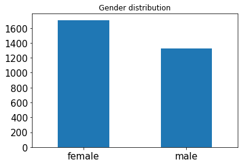


2. Age distribution


```python
PatientInfo['age'].value_counts().plot(kind='bar',title='Age distribution',fontsize=15, rot=360)
```


    <matplotlib.axes._subplots.AxesSubplot at 0x229693ed588>


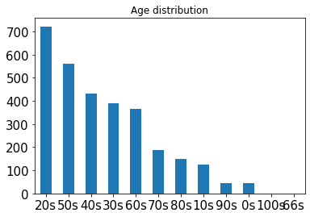


3. Top ten cities with the most patients


```python
city=PatientInfo['city'].value_counts()
city= city.sort_values(ascending=False)[:10]
city.sort_values(ascending=True).plot.barh(fontsize=15)
plt.title('Top ten cities with the most patients',size=15)
plt.show()
```


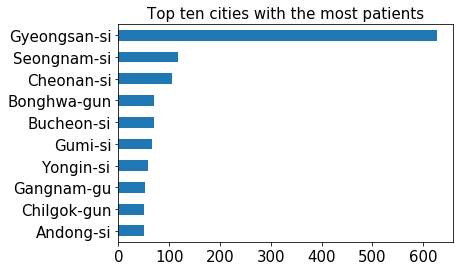


4. Top ten province with the most patients


```python
province=PatientInfo['province'].value_counts()
province= province.sort_values(ascending=False)[:10]
province.sort_values(ascending=True).plot.barh(fontsize=15)
plt.title('Top ten provinces with the most patients',size=15)
plt.show()
```


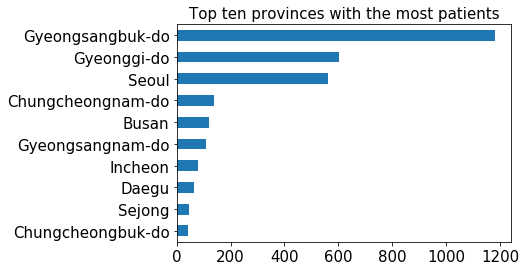


5. Top ten infection_case of patients


```python
infection_case=PatientInfo['infection_case'].value_counts()
infection_case= infection_case.sort_values(ascending=False)[:10]
infection_case.sort_values(ascending=True).plot.barh(fontsize=15)
plt.title('Top ten infection_case of patients',size=15)
plt.show()
```


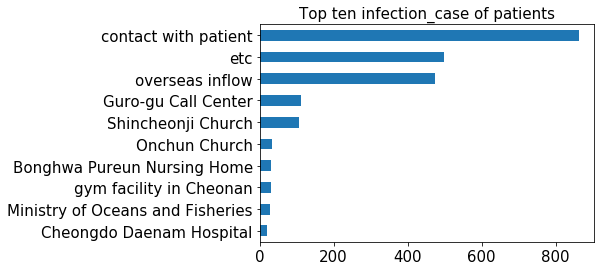


6. The relation between sex and state among patients.


```python
sns.countplot(x="state", hue="sex", data=PatientInfo)
```


    <matplotlib.axes._subplots.AxesSubplot at 0x22968175c48>


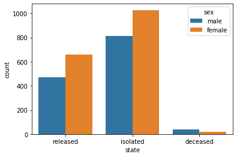


7. The relation between age and state among patients.


```python
sns.countplot(x="state", hue="age", data=PatientInfo)
```


    <matplotlib.axes._subplots.AxesSubplot at 0x229694a0048>


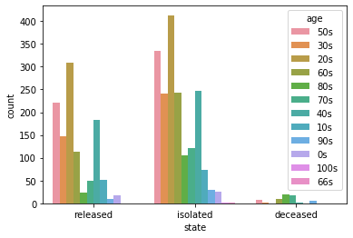


8. The relation between the top five cities with most patients and state among patients.


```python
top_five_cities=PatientInfo[PatientInfo['city'].isin(['Gyeongsan-si','Seongnam-si','Bonghwa-gun','Bucheon-si','Gumi-si'])]
sns.countplot(x="state", hue="city", data=top_five_cities)
```


    <matplotlib.axes._subplots.AxesSubplot at 0x2296a829608>


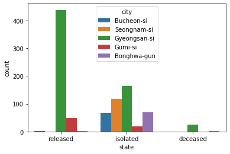


9. The relation between the top five provinces with most patients and state among patients.


```python
top_five_provinces=PatientInfo[PatientInfo['province'].isin(['Gyeongsangbuk-do','Gyeonggi-do','Seoul','Chungcheongnam-do','Busan'])]
sns.countplot(x="state", hue="province", data=top_five_provinces)
```


    <matplotlib.axes._subplots.AxesSubplot at 0x2296a8ba348>


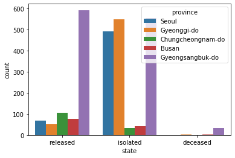


10. The relation between the top five infection_case with most patients and state among patients.


```python
top_five_infection_case=PatientInfo[PatientInfo['infection_case'].
                                    isin(['contact with patient','etc','overseas inflow','Guro-gu Call Center','Shincheonji Church'])]
sns.countplot(x="state", hue="infection_case", data=top_five_infection_case)
```


    <matplotlib.axes._subplots.AxesSubplot at 0x2296b922708>


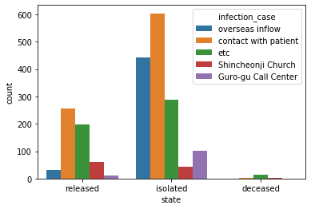


**Conclusion:**

After preliminary data visualization analysis, we can find that the number of female patients is about 300 larger than the number of male patients, most patients are aged from 20 to 60, most patients are form the city Gyeongsan-si, most patients are form the provinces  Gyeongsangbuk-do, Gyeonggi-do and Seoul and most infection cases are contact with patient, etc and overseas inflow.

By analysing the states of patients(isolated / released / deceased) and other attributes, we can find that male patients may be a little easier to be deceased than female patients because the number of female patients is larger than the number of male patients but the number of  deceased female patients is less than the number of deceased male patients.

We can also find that younger patients may be easier to be released than older patients and older patients may be easier to be deceased than older patients.

We can also find that contacting with patients around you in your city and province is the main reason people get infected.
#### 2.1.3 Visualize the Time Series Data 
1. Visualize the File Time


```python
Time = pd.read_csv('Time.csv')
Time.head(5)
```


<div>
<style scoped>
    .dataframe tbody tr th:only-of-type {
        vertical-align: middle;
    }

    .dataframe tbody tr th {
        vertical-align: top;
    }
    
    .dataframe thead th {
        text-align: right;
    }
</style>
<table border="1" class="dataframe">
  <thead>
    <tr style="text-align: right;">
      <th></th>
      <th>date</th>
      <th>time</th>
      <th>test</th>
      <th>negative</th>
      <th>confirmed</th>
      <th>released</th>
      <th>deceased</th>
    </tr>
  </thead>
  <tbody>
    <tr>
      <th>0</th>
      <td>2020-01-20</td>
      <td>16</td>
      <td>1</td>
      <td>0</td>
      <td>1</td>
      <td>0</td>
      <td>0</td>
    </tr>
    <tr>
      <th>1</th>
      <td>2020-01-21</td>
      <td>16</td>
      <td>1</td>
      <td>0</td>
      <td>1</td>
      <td>0</td>
      <td>0</td>
    </tr>
    <tr>
      <th>2</th>
      <td>2020-01-22</td>
      <td>16</td>
      <td>4</td>
      <td>3</td>
      <td>1</td>
      <td>0</td>
      <td>0</td>
    </tr>
    <tr>
      <th>3</th>
      <td>2020-01-23</td>
      <td>16</td>
      <td>22</td>
      <td>21</td>
      <td>1</td>
      <td>0</td>
      <td>0</td>
    </tr>
    <tr>
      <th>4</th>
      <td>2020-01-24</td>
      <td>16</td>
      <td>27</td>
      <td>25</td>
      <td>2</td>
      <td>0</td>
      <td>0</td>
    </tr>
  </tbody>
</table>
</div>


```python
#We do not care the update time so we drop it.
Time.drop(['time'],axis=1,inplace=True)
Time.set_index('date',inplace=True)
Time.head(5)
```


<div>
<style scoped>
    .dataframe tbody tr th:only-of-type {
        vertical-align: middle;
    }

    .dataframe tbody tr th {
        vertical-align: top;
    }
    
    .dataframe thead th {
        text-align: right;
    }
</style>
<table border="1" class="dataframe">
  <thead>
    <tr style="text-align: right;">
      <th></th>
      <th>test</th>
      <th>negative</th>
      <th>confirmed</th>
      <th>released</th>
      <th>deceased</th>
    </tr>
    <tr>
      <th>date</th>
      <th></th>
      <th></th>
      <th></th>
      <th></th>
      <th></th>
    </tr>
  </thead>
  <tbody>
    <tr>
      <th>2020-01-20</th>
      <td>1</td>
      <td>0</td>
      <td>1</td>
      <td>0</td>
      <td>0</td>
    </tr>
    <tr>
      <th>2020-01-21</th>
      <td>1</td>
      <td>0</td>
      <td>1</td>
      <td>0</td>
      <td>0</td>
    </tr>
    <tr>
      <th>2020-01-22</th>
      <td>4</td>
      <td>3</td>
      <td>1</td>
      <td>0</td>
      <td>0</td>
    </tr>
    <tr>
      <th>2020-01-23</th>
      <td>22</td>
      <td>21</td>
      <td>1</td>
      <td>0</td>
      <td>0</td>
    </tr>
    <tr>
      <th>2020-01-24</th>
      <td>27</td>
      <td>25</td>
      <td>2</td>
      <td>0</td>
      <td>0</td>
    </tr>
  </tbody>
</table>
</div>


```python
fig, ax = plt.subplots(figsize=(12,6))
Time.plot(marker='o',ms=2,lw=1,ax=ax)
fig.autofmt_xdate()
plt.legend(bbox_to_anchor = [1,1])
plt.title('COVID-19 Data of South Korea',size=15)
plt.ylabel('number')
plt.grid(axis='y')
plt.show()
```


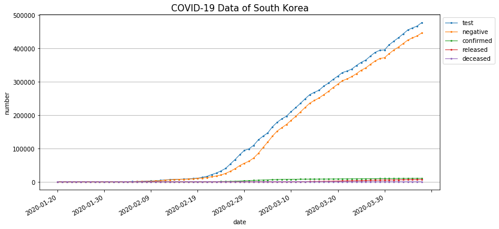


The figure is not very clear because the accumulated test and negative number is much larger that the rest numbers.
Hence we will just focus on the number of confirmed, released and deceased patients.


```python
Time.drop(['test','negative'],axis=1,inplace=True)
fig, ax = plt.subplots(figsize=(12,6))
Time.plot(marker='o',ms=2,lw=1,ax=ax)
fig.autofmt_xdate()
plt.legend(bbox_to_anchor = [1,1])
plt.title('COVID-19 Data of South Korea',size=15)
plt.ylabel('number')
plt.grid(axis='y')
plt.show()
```


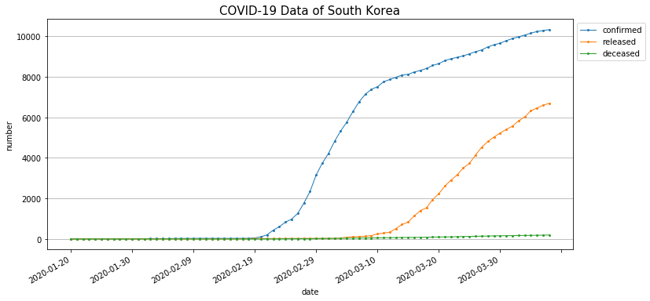


2. Visualize the File TimeAge


```python
TimeAge = pd.read_csv('TimeAge.csv')
TimeAge.head(5)
```


<div>
<style scoped>
    .dataframe tbody tr th:only-of-type {
        vertical-align: middle;
    }

    .dataframe tbody tr th {
        vertical-align: top;
    }
    
    .dataframe thead th {
        text-align: right;
    }
</style>
<table border="1" class="dataframe">
  <thead>
    <tr style="text-align: right;">
      <th></th>
      <th>date</th>
      <th>time</th>
      <th>age</th>
      <th>confirmed</th>
      <th>deceased</th>
    </tr>
  </thead>
  <tbody>
    <tr>
      <th>0</th>
      <td>2020-03-02</td>
      <td>0</td>
      <td>0s</td>
      <td>32</td>
      <td>0</td>
    </tr>
    <tr>
      <th>1</th>
      <td>2020-03-02</td>
      <td>0</td>
      <td>10s</td>
      <td>169</td>
      <td>0</td>
    </tr>
    <tr>
      <th>2</th>
      <td>2020-03-02</td>
      <td>0</td>
      <td>20s</td>
      <td>1235</td>
      <td>0</td>
    </tr>
    <tr>
      <th>3</th>
      <td>2020-03-02</td>
      <td>0</td>
      <td>30s</td>
      <td>506</td>
      <td>1</td>
    </tr>
    <tr>
      <th>4</th>
      <td>2020-03-02</td>
      <td>0</td>
      <td>40s</td>
      <td>633</td>
      <td>1</td>
    </tr>
  </tbody>
</table>
</div>


```python
#We do not care the update time so we drop it.
TimeAge.drop(['time'],axis=1,inplace=True)
TimeAge.head(5)
```


<div>
<style scoped>
    .dataframe tbody tr th:only-of-type {
        vertical-align: middle;
    }

    .dataframe tbody tr th {
        vertical-align: top;
    }
    
    .dataframe thead th {
        text-align: right;
    }
</style>
<table border="1" class="dataframe">
  <thead>
    <tr style="text-align: right;">
      <th></th>
      <th>date</th>
      <th>age</th>
      <th>confirmed</th>
      <th>deceased</th>
    </tr>
  </thead>
  <tbody>
    <tr>
      <th>0</th>
      <td>2020-03-02</td>
      <td>0s</td>
      <td>32</td>
      <td>0</td>
    </tr>
    <tr>
      <th>1</th>
      <td>2020-03-02</td>
      <td>10s</td>
      <td>169</td>
      <td>0</td>
    </tr>
    <tr>
      <th>2</th>
      <td>2020-03-02</td>
      <td>20s</td>
      <td>1235</td>
      <td>0</td>
    </tr>
    <tr>
      <th>3</th>
      <td>2020-03-02</td>
      <td>30s</td>
      <td>506</td>
      <td>1</td>
    </tr>
    <tr>
      <th>4</th>
      <td>2020-03-02</td>
      <td>40s</td>
      <td>633</td>
      <td>1</td>
    </tr>
  </tbody>
</table>
</div>


```python
#processing of Dataframe TimeAge to make it easy to draw clear figures.
Age0=TimeAge[TimeAge['age']=='0s']
Age0=Age0.rename(columns={'confirmed':'confirmed_0s'})
Age0=Age0.rename(columns={'deceased':'deceased_0s'})
Age1=TimeAge[TimeAge['age']=='10s']
Age1=Age1.rename(columns={'confirmed':'confirmed_10s'})
Age1=Age1.rename(columns={'deceased':'deceased_10s'})
Age2=TimeAge[TimeAge['age']=='20s']
Age2=Age2.rename(columns={'confirmed':'confirmed_20s'})
Age2=Age2.rename(columns={'deceased':'deceased_20s'})
Age3=TimeAge[TimeAge['age']=='30s']
Age3=Age3.rename(columns={'confirmed':'confirmed_30s'})
Age3=Age3.rename(columns={'deceased':'deceased_30s'})
Age4=TimeAge[TimeAge['age']=='40s']
Age4=Age4.rename(columns={'confirmed':'confirmed_40s'})
Age4=Age4.rename(columns={'deceased':'deceased_40s'})
Age5=TimeAge[TimeAge['age']=='50s']
Age5=Age5.rename(columns={'confirmed':'confirmed_50s'})
Age5=Age5.rename(columns={'deceased':'deceased_50s'})
Age6=TimeAge[TimeAge['age']=='60s']
Age6=Age6.rename(columns={'confirmed':'confirmed_60s'})
Age6=Age6.rename(columns={'deceased':'deceased_60s'})
Age7=TimeAge[TimeAge['age']=='70s']
Age7=Age7.rename(columns={'confirmed':'confirmed_70s'})
Age7=Age7.rename(columns={'deceased':'deceased_70s'})
Age8=TimeAge[TimeAge['age']=='80s']
Age8=Age8.rename(columns={'confirmed':'confirmed_80s'})
Age8=Age8.rename(columns={'deceased':'deceased_80s'})

result = pd.merge(Age0, Age1, on='date')
result=pd.merge(result, Age2, on='date')
result=pd.merge(result, Age3, on='date')
result=pd.merge(result, Age4, on='date')
result=pd.merge(result, Age5, on='date')
result=pd.merge(result, Age6, on='date')
result=pd.merge(result, Age7, on='date')
result=pd.merge(result, Age8, on='date')
result.set_index(['date'],inplace=True)
result.head(5)
```


<div>
<style scoped>
    .dataframe tbody tr th:only-of-type {
        vertical-align: middle;
    }

    .dataframe tbody tr th {
        vertical-align: top;
    }
    
    .dataframe thead th {
        text-align: right;
    }
</style>
<table border="1" class="dataframe">
  <thead>
    <tr style="text-align: right;">
      <th></th>
      <th>age_x</th>
      <th>confirmed_0s</th>
      <th>deceased_0s</th>
      <th>age_y</th>
      <th>confirmed_10s</th>
      <th>deceased_10s</th>
      <th>age_x</th>
      <th>confirmed_20s</th>
      <th>deceased_20s</th>
      <th>age_y</th>
      <th>...</th>
      <th>deceased_50s</th>
      <th>age_x</th>
      <th>confirmed_60s</th>
      <th>deceased_60s</th>
      <th>age_y</th>
      <th>confirmed_70s</th>
      <th>deceased_70s</th>
      <th>age</th>
      <th>confirmed_80s</th>
      <th>deceased_80s</th>
    </tr>
    <tr>
      <th>date</th>
      <th></th>
      <th></th>
      <th></th>
      <th></th>
      <th></th>
      <th></th>
      <th></th>
      <th></th>
      <th></th>
      <th></th>
      <th></th>
      <th></th>
      <th></th>
      <th></th>
      <th></th>
      <th></th>
      <th></th>
      <th></th>
      <th></th>
      <th></th>
      <th></th>
    </tr>
  </thead>
  <tbody>
    <tr>
      <th>2020-03-02</th>
      <td>0s</td>
      <td>32</td>
      <td>0</td>
      <td>10s</td>
      <td>169</td>
      <td>0</td>
      <td>20s</td>
      <td>1235</td>
      <td>0</td>
      <td>30s</td>
      <td>...</td>
      <td>5</td>
      <td>60s</td>
      <td>530</td>
      <td>6</td>
      <td>70s</td>
      <td>192</td>
      <td>6</td>
      <td>80s</td>
      <td>81</td>
      <td>3</td>
    </tr>
    <tr>
      <th>2020-03-03</th>
      <td>0s</td>
      <td>34</td>
      <td>0</td>
      <td>10s</td>
      <td>204</td>
      <td>0</td>
      <td>20s</td>
      <td>1417</td>
      <td>0</td>
      <td>30s</td>
      <td>...</td>
      <td>5</td>
      <td>60s</td>
      <td>597</td>
      <td>7</td>
      <td>70s</td>
      <td>224</td>
      <td>9</td>
      <td>80s</td>
      <td>93</td>
      <td>5</td>
    </tr>
    <tr>
      <th>2020-03-04</th>
      <td>0s</td>
      <td>34</td>
      <td>0</td>
      <td>10s</td>
      <td>233</td>
      <td>0</td>
      <td>20s</td>
      <td>1575</td>
      <td>0</td>
      <td>30s</td>
      <td>...</td>
      <td>5</td>
      <td>60s</td>
      <td>646</td>
      <td>7</td>
      <td>70s</td>
      <td>260</td>
      <td>12</td>
      <td>80s</td>
      <td>108</td>
      <td>6</td>
    </tr>
    <tr>
      <th>2020-03-05</th>
      <td>0s</td>
      <td>38</td>
      <td>0</td>
      <td>10s</td>
      <td>257</td>
      <td>0</td>
      <td>20s</td>
      <td>1727</td>
      <td>0</td>
      <td>30s</td>
      <td>...</td>
      <td>5</td>
      <td>60s</td>
      <td>699</td>
      <td>8</td>
      <td>70s</td>
      <td>288</td>
      <td>13</td>
      <td>80s</td>
      <td>124</td>
      <td>7</td>
    </tr>
    <tr>
      <th>2020-03-06</th>
      <td>0s</td>
      <td>45</td>
      <td>0</td>
      <td>10s</td>
      <td>292</td>
      <td>0</td>
      <td>20s</td>
      <td>1877</td>
      <td>0</td>
      <td>30s</td>
      <td>...</td>
      <td>5</td>
      <td>60s</td>
      <td>763</td>
      <td>11</td>
      <td>70s</td>
      <td>340</td>
      <td>14</td>
      <td>80s</td>
      <td>168</td>
      <td>10</td>
    </tr>
  </tbody>
</table>
<p>5 rows × 27 columns</p>
</div>


```python
fig, ax = plt.subplots(figsize=(16,10))
result.plot(marker='o',ms=2,lw=1,ax=ax)
fig.autofmt_xdate()
plt.legend(bbox_to_anchor = [1,1])
plt.title('COVID-19 Data of Different Ages',size=15)
plt.ylabel('number')
plt.grid(axis='y')
plt.show()
```


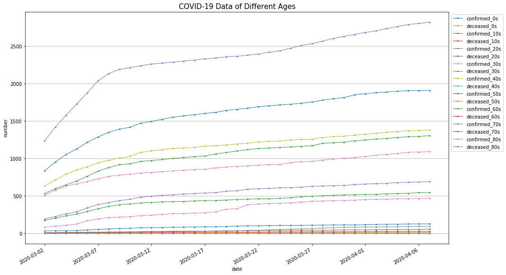


3. Visualize the File TimeGender


```python
TimeGender = pd.read_csv('TimeGender.csv')
TimeGender.head(5)
```


<div>
<style scoped>
    .dataframe tbody tr th:only-of-type {
        vertical-align: middle;
    }

    .dataframe tbody tr th {
        vertical-align: top;
    }
    
    .dataframe thead th {
        text-align: right;
    }
</style>
<table border="1" class="dataframe">
  <thead>
    <tr style="text-align: right;">
      <th></th>
      <th>date</th>
      <th>time</th>
      <th>sex</th>
      <th>confirmed</th>
      <th>deceased</th>
    </tr>
  </thead>
  <tbody>
    <tr>
      <th>0</th>
      <td>2020-03-02</td>
      <td>0</td>
      <td>male</td>
      <td>1591</td>
      <td>13</td>
    </tr>
    <tr>
      <th>1</th>
      <td>2020-03-02</td>
      <td>0</td>
      <td>female</td>
      <td>2621</td>
      <td>9</td>
    </tr>
    <tr>
      <th>2</th>
      <td>2020-03-03</td>
      <td>0</td>
      <td>male</td>
      <td>1810</td>
      <td>16</td>
    </tr>
    <tr>
      <th>3</th>
      <td>2020-03-03</td>
      <td>0</td>
      <td>female</td>
      <td>3002</td>
      <td>12</td>
    </tr>
    <tr>
      <th>4</th>
      <td>2020-03-04</td>
      <td>0</td>
      <td>male</td>
      <td>1996</td>
      <td>20</td>
    </tr>
  </tbody>
</table>
</div>


```python
#The processing is the same as the one above.
TimeGender.drop(['time'],axis=1,inplace=True)
male=TimeGender[TimeGender['sex']=='male']
male=male.rename(columns={'confirmed':'confirmed_male'})
male=male.rename(columns={'deceased':'deceased_male'})
female=TimeGender[TimeGender['sex']=='female']
female=female.rename(columns={'confirmed':'confirmed_female'})
female=female.rename(columns={'deceased':'deceased_female'})
result = pd.merge(female ,male, on='date')
result.set_index(['date'],inplace=True)
result.head(5)
```


<div>
<style scoped>
    .dataframe tbody tr th:only-of-type {
        vertical-align: middle;
    }

    .dataframe tbody tr th {
        vertical-align: top;
    }
    
    .dataframe thead th {
        text-align: right;
    }
</style>
<table border="1" class="dataframe">
  <thead>
    <tr style="text-align: right;">
      <th></th>
      <th>sex_x</th>
      <th>confirmed_female</th>
      <th>deceased_female</th>
      <th>sex_y</th>
      <th>confirmed_male</th>
      <th>deceased_male</th>
    </tr>
    <tr>
      <th>date</th>
      <th></th>
      <th></th>
      <th></th>
      <th></th>
      <th></th>
      <th></th>
    </tr>
  </thead>
  <tbody>
    <tr>
      <th>2020-03-02</th>
      <td>female</td>
      <td>2621</td>
      <td>9</td>
      <td>male</td>
      <td>1591</td>
      <td>13</td>
    </tr>
    <tr>
      <th>2020-03-03</th>
      <td>female</td>
      <td>3002</td>
      <td>12</td>
      <td>male</td>
      <td>1810</td>
      <td>16</td>
    </tr>
    <tr>
      <th>2020-03-04</th>
      <td>female</td>
      <td>3332</td>
      <td>12</td>
      <td>male</td>
      <td>1996</td>
      <td>20</td>
    </tr>
    <tr>
      <th>2020-03-05</th>
      <td>female</td>
      <td>3617</td>
      <td>14</td>
      <td>male</td>
      <td>2149</td>
      <td>21</td>
    </tr>
    <tr>
      <th>2020-03-06</th>
      <td>female</td>
      <td>3939</td>
      <td>17</td>
      <td>male</td>
      <td>2345</td>
      <td>25</td>
    </tr>
  </tbody>
</table>
</div>


```python
fig, ax = plt.subplots(figsize=(16,8))
result.plot(marker='o',ms=2,lw=1,ax=ax)
fig.autofmt_xdate()
plt.legend(bbox_to_anchor = [1,1])
plt.title('COVID-19 Data of Different Genders',size=15)
plt.ylabel('number')
plt.grid(axis='y')
plt.show()
```


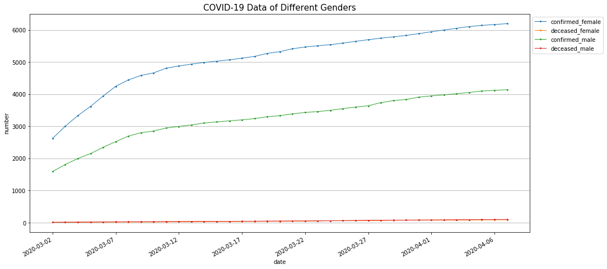


4. Visualize the File TimeProvince


```python
TimeProvince=pd.read_csv('TimeProvince.csv')
TimeProvince.head(5)
```


<div>
<style scoped>
    .dataframe tbody tr th:only-of-type {
        vertical-align: middle;
    }

    .dataframe tbody tr th {
        vertical-align: top;
    }
    
    .dataframe thead th {
        text-align: right;
    }
</style>
<table border="1" class="dataframe">
  <thead>
    <tr style="text-align: right;">
      <th></th>
      <th>date</th>
      <th>time</th>
      <th>province</th>
      <th>confirmed</th>
      <th>released</th>
      <th>deceased</th>
    </tr>
  </thead>
  <tbody>
    <tr>
      <th>0</th>
      <td>2020-01-20</td>
      <td>16</td>
      <td>Seoul</td>
      <td>0</td>
      <td>0</td>
      <td>0</td>
    </tr>
    <tr>
      <th>1</th>
      <td>2020-01-20</td>
      <td>16</td>
      <td>Busan</td>
      <td>0</td>
      <td>0</td>
      <td>0</td>
    </tr>
    <tr>
      <th>2</th>
      <td>2020-01-20</td>
      <td>16</td>
      <td>Daegu</td>
      <td>0</td>
      <td>0</td>
      <td>0</td>
    </tr>
    <tr>
      <th>3</th>
      <td>2020-01-20</td>
      <td>16</td>
      <td>Incheon</td>
      <td>1</td>
      <td>0</td>
      <td>0</td>
    </tr>
    <tr>
      <th>4</th>
      <td>2020-01-20</td>
      <td>16</td>
      <td>Gwangju</td>
      <td>0</td>
      <td>0</td>
      <td>0</td>
    </tr>
  </tbody>
</table>
</div>


```python
#It will be a mass if we draw the imformatin of all provinces, so we choose to draw the figure of the top 5 provinces with most patients.
TimeProvince.drop(['time'],axis=1,inplace=True)
p1=TimeProvince[TimeProvince['province']=='Gyeongsangbuk-do']
p1=p1.rename(columns={'confirmed':'confirmed_Gyeongsangbuk-do'})
p1=p1.rename(columns={'released':'released_Gyeongsangbuk-do'})
p1=p1.rename(columns={'deceased':'deceased_Gyeongsangbuk-do'})
p2=TimeProvince[TimeProvince['province']=='Gyeonggi-do']
p2=p2.rename(columns={'confirmed':'confirmed_Gyeonggi-do'})
p2=p2.rename(columns={'released':'released_Gyeonggi-do'})
p2=p2.rename(columns={'deceased':'deceased_Gyeonggi-do'})
p3=TimeProvince[TimeProvince['province']=='Seoul']
p3=p3.rename(columns={'confirmed':'confirmed_Seoul'})
p3=p3.rename(columns={'released':'released_Seoul'})
p3=p3.rename(columns={'deceased':'deceased_Seoul'})
p4=TimeProvince[TimeProvince['province']=='Chungcheongnam-do']
p4=p4.rename(columns={'confirmed':'confirmed_Chungcheongnam-do'})
p4=p4.rename(columns={'released':'released_Chungcheongnam-do'})
p4=p4.rename(columns={'deceased':'deceased_Chungcheongnam-do'})
p5=TimeProvince[TimeProvince['province']=='Busan']
p5=p5.rename(columns={'confirmed':'confirmed_Busan'})
p5=p5.rename(columns={'released':'released_Busan'})
p5=p5.rename(columns={'deceased':'deceased_Busan'})
result = pd.merge(p1,p2, on='date')
result = pd.merge(result,p3, on='date')
result = pd.merge(result,p4, on='date')
result = pd.merge(result,p5, on='date')
result.set_index(['date'],inplace=True)
result.head(5)
```


<div>
<style scoped>
    .dataframe tbody tr th:only-of-type {
        vertical-align: middle;
    }

    .dataframe tbody tr th {
        vertical-align: top;
    }
    
    .dataframe thead th {
        text-align: right;
    }
</style>
<table border="1" class="dataframe">
  <thead>
    <tr style="text-align: right;">
      <th></th>
      <th>province_x</th>
      <th>confirmed_Gyeongsangbuk-do</th>
      <th>released_Gyeongsangbuk-do</th>
      <th>deceased_Gyeongsangbuk-do</th>
      <th>province_y</th>
      <th>confirmed_Gyeonggi-do</th>
      <th>released_Gyeonggi-do</th>
      <th>deceased_Gyeonggi-do</th>
      <th>province_x</th>
      <th>confirmed_Seoul</th>
      <th>released_Seoul</th>
      <th>deceased_Seoul</th>
      <th>province_y</th>
      <th>confirmed_Chungcheongnam-do</th>
      <th>released_Chungcheongnam-do</th>
      <th>deceased_Chungcheongnam-do</th>
      <th>province</th>
      <th>confirmed_Busan</th>
      <th>released_Busan</th>
      <th>deceased_Busan</th>
    </tr>
    <tr>
      <th>date</th>
      <th></th>
      <th></th>
      <th></th>
      <th></th>
      <th></th>
      <th></th>
      <th></th>
      <th></th>
      <th></th>
      <th></th>
      <th></th>
      <th></th>
      <th></th>
      <th></th>
      <th></th>
      <th></th>
      <th></th>
      <th></th>
      <th></th>
      <th></th>
    </tr>
  </thead>
  <tbody>
    <tr>
      <th>2020-01-20</th>
      <td>Gyeongsangbuk-do</td>
      <td>0</td>
      <td>0</td>
      <td>0</td>
      <td>Gyeonggi-do</td>
      <td>0</td>
      <td>0</td>
      <td>0</td>
      <td>Seoul</td>
      <td>0</td>
      <td>0</td>
      <td>0</td>
      <td>Chungcheongnam-do</td>
      <td>0</td>
      <td>0</td>
      <td>0</td>
      <td>Busan</td>
      <td>0</td>
      <td>0</td>
      <td>0</td>
    </tr>
    <tr>
      <th>2020-01-21</th>
      <td>Gyeongsangbuk-do</td>
      <td>0</td>
      <td>0</td>
      <td>0</td>
      <td>Gyeonggi-do</td>
      <td>0</td>
      <td>0</td>
      <td>0</td>
      <td>Seoul</td>
      <td>0</td>
      <td>0</td>
      <td>0</td>
      <td>Chungcheongnam-do</td>
      <td>0</td>
      <td>0</td>
      <td>0</td>
      <td>Busan</td>
      <td>0</td>
      <td>0</td>
      <td>0</td>
    </tr>
    <tr>
      <th>2020-01-22</th>
      <td>Gyeongsangbuk-do</td>
      <td>0</td>
      <td>0</td>
      <td>0</td>
      <td>Gyeonggi-do</td>
      <td>0</td>
      <td>0</td>
      <td>0</td>
      <td>Seoul</td>
      <td>0</td>
      <td>0</td>
      <td>0</td>
      <td>Chungcheongnam-do</td>
      <td>0</td>
      <td>0</td>
      <td>0</td>
      <td>Busan</td>
      <td>0</td>
      <td>0</td>
      <td>0</td>
    </tr>
    <tr>
      <th>2020-01-23</th>
      <td>Gyeongsangbuk-do</td>
      <td>0</td>
      <td>0</td>
      <td>0</td>
      <td>Gyeonggi-do</td>
      <td>0</td>
      <td>0</td>
      <td>0</td>
      <td>Seoul</td>
      <td>0</td>
      <td>0</td>
      <td>0</td>
      <td>Chungcheongnam-do</td>
      <td>0</td>
      <td>0</td>
      <td>0</td>
      <td>Busan</td>
      <td>0</td>
      <td>0</td>
      <td>0</td>
    </tr>
    <tr>
      <th>2020-01-24</th>
      <td>Gyeongsangbuk-do</td>
      <td>0</td>
      <td>0</td>
      <td>0</td>
      <td>Gyeonggi-do</td>
      <td>1</td>
      <td>0</td>
      <td>0</td>
      <td>Seoul</td>
      <td>0</td>
      <td>0</td>
      <td>0</td>
      <td>Chungcheongnam-do</td>
      <td>0</td>
      <td>0</td>
      <td>0</td>
      <td>Busan</td>
      <td>0</td>
      <td>0</td>
      <td>0</td>
    </tr>
  </tbody>
</table>
</div>


```python
fig, ax = plt.subplots(figsize=(16,10))
result.plot(marker='o',ms=2,lw=1,ax=ax)
fig.autofmt_xdate()
plt.legend(bbox_to_anchor = [1,1])
plt.title('COVID-19 Data of Different Provinces',size=15)
plt.ylabel('number')
plt.grid(axis='y')
plt.show()
```


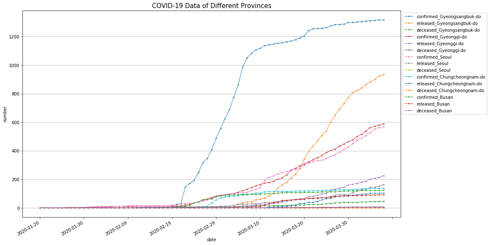


**Conclusion:**

Through these time series figures, I find that from February 22, 2020, South Korea began to increase the number of daily tests, and the number of newly diagnosed people in South Korea also increased rapidly. The most newly confirmed patients are in the age group 20s and 50s. There are more newly diagnosed female patients than male patients.A large number of newly confirmed cases came from the province of Gyeongsangbuk-do, and the number of newly confirmed diagnoses in other provinces gradually increased a few days later.

### 2.2 Prediction of the Recovery Time of the Patients
#### 2.2.1 Data Preprocessing 


```python
#count miss value of each column
index_array = np.sum(PatientInfo.isnull() == True, axis=0)
print(index_array)
print(PatientInfo.shape[0])
```

    patient_id               0
    global_num            1160
    sex                     94
    birth_year             464
    age                    105
    country                 90
    province                 0
    city                    76
    disease               3110
    infection_case         819
    infection_order       3097
    infected_by           2393
    contact_number        2539
    symptom_onset_date    2682
    confirmed_date           0
    released_date         2147
    deceased_date         3072
    state                    0
    dtype: int64
    3128


I want to build a regression model to predict of the recovery time of the patients.

Firstly I do data preprocessing to the data. 
It is easy to define the ‘recovery time’ as the difference between ‘released_date’ and ‘confirmed_date’.
For the ‘deceased’patients,I choose to simply delete it in this task and I will find the rows that released_date is not null
and calculte the recovery time and join the table with the table Region to get more information.

Finally I will delete some useless column and do some data coding and discretization and normalization.


```python
data_released = PatientInfo[PatientInfo['released_date'].notnull()]
data_released=data_released[data_released['state']=='released']
data_released['recover_days']=(pd.to_datetime(data_released['released_date'])-pd.to_datetime(data_released['confirmed_date'])).dt.days
Region=pd.read_csv('Region.csv')
result = pd.merge(data_released,Region, on=['city','province'])
#count miss value of each column of the new table
index_array = np.sum(result.isnull() == True, axis=0)
print(index_array)
```

    patient_id                    0
    global_num                  357
    sex                           0
    birth_year                  130
    age                           2
    country                       0
    province                      0
    city                          0
    disease                     952
    infection_case              451
    infection_order             926
    infected_by                 759
    contact_number              724
    symptom_onset_date          857
    confirmed_date                0
    released_date                 0
    deceased_date               952
    state                         0
    recover_days                  0
    code                          0
    latitude                      0
    longitude                     0
    elementary_school_count       0
    kindergarten_count            0
    university_count              0
    academy_ratio                 0
    elderly_population_ratio      0
    elderly_alone_ratio           0
    nursing_home_count            0
    dtype: int64


We notice that some columns with too much miss value should be ignored. Since birth_year is more accurate than age, we choose to fill the miss value in age and then use age to fill birth_year with media value i.e. 20s will be considered as 25 years old and then 
we use 2020-25 to calculate his birth_year.


```python
age=result['age'].value_counts()
age= age.sort_values(ascending=False)[:10]
age
```


    20s    251
    50s    195
    40s    165
    30s    119
    60s     95
    10s     43
    70s     39
    80s     21
    0s      13
    90s      9
    Name: age, dtype: int64


```python
#fill the miss value of the column age with mode '20s'
result['age'] = result['age'].fillna('20s')
result['age_int']=result['age'].apply(lambda x: (int)(x[0:1]))
result['birth_year']=result['birth_year'].fillna(2020-5-result['age_int']*10)
index_array = np.sum(result.isnull() == True, axis=0)
print(index_array)
```

    patient_id                    0
    global_num                  357
    sex                           0
    birth_year                    0
    age                           0
    country                       0
    province                      0
    city                          0
    disease                     952
    infection_case              451
    infection_order             926
    infected_by                 759
    contact_number              724
    symptom_onset_date          857
    confirmed_date                0
    released_date                 0
    deceased_date               952
    state                         0
    recover_days                  0
    code                          0
    latitude                      0
    longitude                     0
    elementary_school_count       0
    kindergarten_count            0
    university_count              0
    academy_ratio                 0
    elderly_population_ratio      0
    elderly_alone_ratio           0
    nursing_home_count            0
    age_int                       0
    dtype: int64


I find that there is no miss value in the columns that will be used later. Then I will normalize the data and encode the column sex.


```python
col=['birth_year','elementary_school_count','kindergarten_count','university_count','academy_ratio','elderly_population_ratio',
    'latitude','longitude','elderly_alone_ratio','nursing_home_count','age_int']
temp=result[col]
#using min-max normalization
data_pca=temp
temp = (temp-temp.min())/(temp.max()-temp.min())
Map={'male':0,'female':1}
temp['sex']=result['sex']
temp['sex'] = temp['sex'].map(Map)
temp['recover_days']=result['recover_days']
temp['birth_year']=temp['birth_year']
temp.head(5)
```


<div>
<style scoped>
    .dataframe tbody tr th:only-of-type {
        vertical-align: middle;
    }

    .dataframe tbody tr th {
        vertical-align: top;
    }
    
    .dataframe thead th {
        text-align: right;
    }
</style>
<table border="1" class="dataframe">
  <thead>
    <tr style="text-align: right;">
      <th></th>
      <th>birth_year</th>
      <th>elementary_school_count</th>
      <th>kindergarten_count</th>
      <th>university_count</th>
      <th>academy_ratio</th>
      <th>elderly_population_ratio</th>
      <th>latitude</th>
      <th>longitude</th>
      <th>elderly_alone_ratio</th>
      <th>nursing_home_count</th>
      <th>age_int</th>
      <th>sex</th>
      <th>recover_days</th>
    </tr>
  </thead>
  <tbody>
    <tr>
      <th>0</th>
      <td>0.410526</td>
      <td>0.293578</td>
      <td>0.268421</td>
      <td>0.1</td>
      <td>0.212042</td>
      <td>0.243018</td>
      <td>0.860991</td>
      <td>0.134585</td>
      <td>0.143713</td>
      <td>0.339691</td>
      <td>0.555556</td>
      <td>0</td>
      <td>13</td>
    </tr>
    <tr>
      <th>1</th>
      <td>0.452632</td>
      <td>0.293578</td>
      <td>0.268421</td>
      <td>0.1</td>
      <td>0.212042</td>
      <td>0.243018</td>
      <td>0.860991</td>
      <td>0.134585</td>
      <td>0.143713</td>
      <td>0.339691</td>
      <td>0.555556</td>
      <td>0</td>
      <td>10</td>
    </tr>
    <tr>
      <th>2</th>
      <td>0.652632</td>
      <td>0.174312</td>
      <td>0.136842</td>
      <td>0.1</td>
      <td>0.089005</td>
      <td>0.324991</td>
      <td>0.872790</td>
      <td>0.216556</td>
      <td>0.215569</td>
      <td>0.211115</td>
      <td>0.333333</td>
      <td>0</td>
      <td>32</td>
    </tr>
    <tr>
      <th>3</th>
      <td>0.410526</td>
      <td>0.082569</td>
      <td>0.063158</td>
      <td>0.3</td>
      <td>0.353403</td>
      <td>0.383750</td>
      <td>0.865619</td>
      <td>0.178304</td>
      <td>0.209581</td>
      <td>0.204209</td>
      <td>0.555556</td>
      <td>0</td>
      <td>20</td>
    </tr>
    <tr>
      <th>4</th>
      <td>0.431579</td>
      <td>0.082569</td>
      <td>0.063158</td>
      <td>0.3</td>
      <td>0.353403</td>
      <td>0.383750</td>
      <td>0.865619</td>
      <td>0.178304</td>
      <td>0.209581</td>
      <td>0.204209</td>
      <td>0.555556</td>
      <td>1</td>
      <td>19</td>
    </tr>
  </tbody>
</table>
</div>


#### 2.2.2 Data Prediction
It is well known that how long a confirmed patient will recover mainly depends on his physical health condition and whether he has other underlying diseases. We do not have any data on the health indicators of patients, so it is very hard to build an accurate model.

I will compare some models to see how they work on this dataset.

Firstly I will divide the samples into training set and test set and the test set accounted for 30%.


```python
y = temp['recover_days']
X = temp.copy().drop(['recover_days'], axis=1)
X_train, X_test, y_train, y_test = train_test_split(X, y, test_size = 0.3,random_state=33)
```


```python
#1.LinearRegression
lr = LinearRegression()
lr.fit(X_train, y_train)
predicted = lr.predict(X_test)
print('R_square_value: ')
print(round(r2_score(y_test, predicted),3))
print( 'MSE_value: ')
print(round(mean_squared_error(y_test, predicted),3))
```

    R_square_value: 
    0.077
    MSE_value: 
    52.682


```python
#2.RidgeRegression
model = RidgeCV(alphas=[0.5,0.6,0.7,0.8,0.9,0.4,0.3,0.1,0.2,1])
model.fit(X_train,y_train)
predicted = model.predict(X_test)
print('R_square_value: ')
print(round(r2_score(y_test, predicted),4))
print( 'MSE_value: ')
print(round(mean_squared_error(y_test, predicted),4))
```

    R_square_value: 
    0.0785
    MSE_value: 
    52.6262


```python
#3.LassoRegression
model = LassoLarsCV()  # LassoLarsCV自动调节alpha可以实现选择最佳的alpha
model.fit(X_train,y_train) 
predicted = model.predict(X_test)
print('R_square_value: ')
print(round(r2_score(y_test, predicted),4))
print( 'MSE_value: ')
print(round(mean_squared_error(y_test, predicted),4))
```

    R_square_value: 
    0.0804
    MSE_value: 
    52.5148


```python
#4.Assembled model: GradientBoostingRegressor
gbr=GradientBoostingRegressor()
gbr.fit(X_train,y_train)
predicted=gbr.predict(X_test)
print('R_square_value: ')
print(round(r2_score(y_test, predicted),4))
print( 'MSE_value: ')
print(round(mean_squared_error(y_test, predicted),4))
```

    R_square_value: 
    0.055
    MSE_value: 
    53.9639


**Conclusion:**

I find that no model is accurate because the most important information i.e. physical health condition and whether he has other underlying diseases is unknown.

Comparing the four models, I find that the Assembled model did worst because it may be overfitting in this dataset.

In the other three models, LassoRegression did best because it uses LASSO Regression with L1 form which has a very good variable selection effect.

RidgeRegression uses Ridge Regression with L2 form which has a good variable selection effect so it did better than LinearRegression
but it did worse than LassoRegression.

The LinearRegression did worst in the three models without assembling because it did not use Regression to solve multicollinearity.

#### 2.2.3 Feature Selection and Model Selection

We know that not all features in the dataset will affect the recover time of a patient and some columns may have multicollinearity
and some columns maybe unrelated to the recover time.

A method to choose feature is using iteration and the greedy algorithm. In other words, we choose subset of the features and build
a model on the training set and then test the model on the test set. If the model works better than the prvious one, we keep the 
selection, otherwise we reselect features and build models aga until the model will not be impoved by selecting features.

However, greedy algorithm can find a better model but the result may be not a global optimum solution because it may be 
stuck in a local optimum solution.

The followings are the new model I built after variable selection.


```python
# Divide the samples into training set and test set. 
col1=['elementary_school_count','elderly_population_ratio',
    'latitude','elderly_alone_ratio','nursing_home_count','age_int','recover_days']
temp1=result[col1]
y = temp1['recover_days']
X = temp1.drop(['recover_days'], axis=1)
X_train, X_test, y_train, y_test = train_test_split(X, y, test_size = 0.3,random_state=33)
```


```python
#1.LinearRegression
lr = LinearRegression()
lr.fit(X_train, y_train)
predicted = lr.predict(X_test)
print('R_square_value: ')
print(round(r2_score(y_test, predicted),3))
print( 'MSE_value: ')
print(round(mean_squared_error(y_test, predicted),3))
```

    R_square_value: 
    0.09
    MSE_value: 
    51.953


```python
#2.RidgeRegression
model = RidgeCV(alphas=[0.5,0.6,0.7,0.8,0.9,0.4,0.3,0.1,0.2,1])
model.fit(X_train,y_train)
predicted = model.predict(X_test)
print('R_square_value: ')
print(round(r2_score(y_test, predicted),4))
print( 'MSE_value: ')
print(round(mean_squared_error(y_test, predicted),4))
```

    R_square_value: 
    0.0902
    MSE_value: 
    51.9557


```python
#3.LassoRegression
model = LassoLarsCV()  # LassoLarsCV自动调节alpha可以实现选择最佳的alpha
model.fit(X_train,y_train) 
predicted = model.predict(X_test)
print('R_square_value: ')
print(round(r2_score(y_test, predicted),4))
print( 'MSE_value: ')
print(round(mean_squared_error(y_test, predicted),4))
```

    R_square_value: 
    0.0903
    MSE_value: 
    51.9525


```python
#Assembled model: GradientBoostingRegressor
col2=['elementary_school_count',
    'latitude','elderly_alone_ratio','age_int','recover_days']
temp2=result[col2]
y = temp2['recover_days']
X = temp2.drop(['recover_days'], axis=1)
X_train, X_test, y_train, y_test = train_test_split(X, y, test_size = 0.3,random_state=33)
gbr=GradientBoostingRegressor()
gbr.fit(X_train,y_train)
predicted=gbr.predict(X_test)
print('R_square_value: ')
print(round(r2_score(y_test, predicted),4))
print( 'MSE_value: ')
print(round(mean_squared_error(y_test, predicted),4))
```

    R_square_value: 
    0.1109
    MSE_value: 
    50.7721


**Conclusion:**

By using feature selection, It is obvious that the R_square_value of the four models all increase and the MSE_value of the four models
all decrease which means the four models are all improved.

The best model is the Assembled model: GradientBoostingRegressor because its R_square_value is maximal and its MSE_value is minimal.
However, the assembled model has poor interpretability.

#### 2.2.4 Using PCA to Do Data Preprocessing 


```python
data_pca
```


<div>
<style scoped>
    .dataframe tbody tr th:only-of-type {
        vertical-align: middle;
    }

    .dataframe tbody tr th {
        vertical-align: top;
    }
    
    .dataframe thead th {
        text-align: right;
    }
</style>
<table border="1" class="dataframe">
  <thead>
    <tr style="text-align: right;">
      <th></th>
      <th>birth_year</th>
      <th>elementary_school_count</th>
      <th>kindergarten_count</th>
      <th>university_count</th>
      <th>academy_ratio</th>
      <th>elderly_population_ratio</th>
      <th>latitude</th>
      <th>longitude</th>
      <th>elderly_alone_ratio</th>
      <th>nursing_home_count</th>
      <th>age_int</th>
    </tr>
  </thead>
  <tbody>
    <tr>
      <th>0</th>
      <td>1964.0</td>
      <td>36</td>
      <td>56</td>
      <td>1</td>
      <td>1.17</td>
      <td>14.39</td>
      <td>37.551166</td>
      <td>126.849506</td>
      <td>5.7</td>
      <td>1080</td>
      <td>5</td>
    </tr>
    <tr>
      <th>1</th>
      <td>1968.0</td>
      <td>36</td>
      <td>56</td>
      <td>1</td>
      <td>1.17</td>
      <td>14.39</td>
      <td>37.551166</td>
      <td>126.849506</td>
      <td>5.7</td>
      <td>1080</td>
      <td>5</td>
    </tr>
    <tr>
      <th>2</th>
      <td>1987.0</td>
      <td>23</td>
      <td>31</td>
      <td>1</td>
      <td>0.70</td>
      <td>16.65</td>
      <td>37.606832</td>
      <td>127.092656</td>
      <td>6.9</td>
      <td>689</td>
      <td>3</td>
    </tr>
    <tr>
      <th>3</th>
      <td>1964.0</td>
      <td>13</td>
      <td>17</td>
      <td>3</td>
      <td>1.71</td>
      <td>18.27</td>
      <td>37.572999</td>
      <td>126.979189</td>
      <td>6.8</td>
      <td>668</td>
      <td>5</td>
    </tr>
    <tr>
      <th>4</th>
      <td>1966.0</td>
      <td>13</td>
      <td>17</td>
      <td>3</td>
      <td>1.71</td>
      <td>18.27</td>
      <td>37.572999</td>
      <td>126.979189</td>
      <td>6.8</td>
      <td>668</td>
      <td>5</td>
    </tr>
    <tr>
      <th>...</th>
      <td>...</td>
      <td>...</td>
      <td>...</td>
      <td>...</td>
      <td>...</td>
      <td>...</td>
      <td>...</td>
      <td>...</td>
      <td>...</td>
      <td>...</td>
      <td>...</td>
    </tr>
    <tr>
      <th>947</th>
      <td>1969.0</td>
      <td>17</td>
      <td>16</td>
      <td>2</td>
      <td>1.25</td>
      <td>27.01</td>
      <td>35.686526</td>
      <td>127.910021</td>
      <td>17.4</td>
      <td>127</td>
      <td>5</td>
    </tr>
    <tr>
      <th>948</th>
      <td>1963.0</td>
      <td>17</td>
      <td>16</td>
      <td>2</td>
      <td>1.25</td>
      <td>27.01</td>
      <td>35.686526</td>
      <td>127.910021</td>
      <td>17.4</td>
      <td>127</td>
      <td>5</td>
    </tr>
    <tr>
      <th>949</th>
      <td>1998.0</td>
      <td>113</td>
      <td>123</td>
      <td>4</td>
      <td>1.53</td>
      <td>15.10</td>
      <td>33.488936</td>
      <td>126.500423</td>
      <td>6.4</td>
      <td>1245</td>
      <td>2</td>
    </tr>
    <tr>
      <th>950</th>
      <td>1998.0</td>
      <td>113</td>
      <td>123</td>
      <td>4</td>
      <td>1.53</td>
      <td>15.10</td>
      <td>33.488936</td>
      <td>126.500423</td>
      <td>6.4</td>
      <td>1245</td>
      <td>2</td>
    </tr>
    <tr>
      <th>951</th>
      <td>1974.0</td>
      <td>113</td>
      <td>123</td>
      <td>4</td>
      <td>1.53</td>
      <td>15.10</td>
      <td>33.488936</td>
      <td>126.500423</td>
      <td>6.4</td>
      <td>1245</td>
      <td>4</td>
    </tr>
  </tbody>
</table>
<p>952 rows × 11 columns</p>
</div>


```python
#The dimension of the final data is 3
pca=PCA(n_components=3)
X_pca=pca.fit_transform(data_pca)
df = pd.DataFrame(X_pca)
df = (df-df.min())/(df.max()-df.min())
df
```


<div>
<style scoped>
    .dataframe tbody tr th:only-of-type {
        vertical-align: middle;
    }

    .dataframe tbody tr th {
        vertical-align: top;
    }
    
    .dataframe thead th {
        text-align: right;
    }
</style>
<table border="1" class="dataframe">
  <thead>
    <tr style="text-align: right;">
      <th></th>
      <th>0</th>
      <th>1</th>
      <th>2</th>
    </tr>
  </thead>
  <tbody>
    <tr>
      <th>0</th>
      <td>0.340437</td>
      <td>0.439450</td>
      <td>0.577860</td>
    </tr>
    <tr>
      <th>1</th>
      <td>0.340445</td>
      <td>0.437860</td>
      <td>0.536146</td>
    </tr>
    <tr>
      <th>2</th>
      <td>0.211365</td>
      <td>0.436380</td>
      <td>0.309048</td>
    </tr>
    <tr>
      <th>3</th>
      <td>0.204034</td>
      <td>0.502386</td>
      <td>0.531499</td>
    </tr>
    <tr>
      <th>4</th>
      <td>0.204038</td>
      <td>0.501591</td>
      <td>0.510642</td>
    </tr>
    <tr>
      <th>...</th>
      <td>...</td>
      <td>...</td>
      <td>...</td>
    </tr>
    <tr>
      <th>947</th>
      <td>0.026261</td>
      <td>0.365837</td>
      <td>0.490679</td>
    </tr>
    <tr>
      <th>948</th>
      <td>0.026249</td>
      <td>0.368222</td>
      <td>0.553250</td>
    </tr>
    <tr>
      <th>949</th>
      <td>0.396894</td>
      <td>0.121135</td>
      <td>0.330485</td>
    </tr>
    <tr>
      <th>950</th>
      <td>0.396894</td>
      <td>0.121135</td>
      <td>0.330485</td>
    </tr>
    <tr>
      <th>951</th>
      <td>0.396846</td>
      <td>0.130752</td>
      <td>0.582834</td>
    </tr>
  </tbody>
</table>
<p>952 rows × 3 columns</p>
</div>


```python
y = temp['recover_days']
X = df
X_train, X_test, y_train, y_test = train_test_split(X, y, test_size = 0.3,random_state=33)
```


```python
#1.LinearRegression
lr = LinearRegression()
lr.fit(X_train, y_train)
predicted = lr.predict(X_test)
print('R_square_value: ')
print(round(r2_score(y_test, predicted),3))
print( 'MSE_value: ')
print(round(mean_squared_error(y_test, predicted),3))
```

    R_square_value: 
    0.051
    MSE_value: 
    54.216


```python
#2.Assembled model: GradientBoostingRegressor
gbr=GradientBoostingRegressor()
gbr.fit(X_train,y_train)
predicted=gbr.predict(X_test)
print('R_square_value: ')
print(round(r2_score(y_test, predicted),4))
print( 'MSE_value: ')
print(round(mean_squared_error(y_test, predicted),4))
```

    R_square_value: 
    0.0117
    MSE_value: 
    56.4408


**Conclusion:**

After using PCA to Do  Do Data Preprocessing, we did not get a better model as we have expected. The result is much worse than the result of using the Greedy Algorithm to do the Feature Selection.

I guess the reason is that maybe the dataset is not suitable for the method PCA to do data preprocessing.


### 2.4 Clustering of Risk Levels of the Cities


```python
t=result['city'].value_counts()
df=t.to_frame()
df = df.reset_index()
df=df.rename(columns={'city':'cnt'})
df=df.rename(columns={'index':'city'})
df.head(5)
```


<div>
<style scoped>
    .dataframe tbody tr th:only-of-type {
        vertical-align: middle;
    }

    .dataframe tbody tr th {
        vertical-align: top;
    }
    
    .dataframe thead th {
        text-align: right;
    }
</style>
<table border="1" class="dataframe">
  <thead>
    <tr style="text-align: right;">
      <th></th>
      <th>city</th>
      <th>cnt</th>
    </tr>
  </thead>
  <tbody>
    <tr>
      <th>0</th>
      <td>Gyeongsan-si</td>
      <td>439</td>
    </tr>
    <tr>
      <th>1</th>
      <td>Cheonan-si</td>
      <td>89</td>
    </tr>
    <tr>
      <th>2</th>
      <td>Gumi-si</td>
      <td>49</td>
    </tr>
    <tr>
      <th>3</th>
      <td>Chilgok-gun</td>
      <td>35</td>
    </tr>
    <tr>
      <th>4</th>
      <td>Yeongcheon-si</td>
      <td>22</td>
    </tr>
  </tbody>
</table>
</div>


```python
t = pd.merge(df,Region, on='city')
t.head(5)
```


<div>
<style scoped>
    .dataframe tbody tr th:only-of-type {
        vertical-align: middle;
    }

    .dataframe tbody tr th {
        vertical-align: top;
    }
    
    .dataframe thead th {
        text-align: right;
    }
</style>
<table border="1" class="dataframe">
  <thead>
    <tr style="text-align: right;">
      <th></th>
      <th>city</th>
      <th>cnt</th>
      <th>code</th>
      <th>province</th>
      <th>latitude</th>
      <th>longitude</th>
      <th>elementary_school_count</th>
      <th>kindergarten_count</th>
      <th>university_count</th>
      <th>academy_ratio</th>
      <th>elderly_population_ratio</th>
      <th>elderly_alone_ratio</th>
      <th>nursing_home_count</th>
    </tr>
  </thead>
  <tbody>
    <tr>
      <th>0</th>
      <td>Gyeongsan-si</td>
      <td>439</td>
      <td>60010</td>
      <td>Gyeongsangbuk-do</td>
      <td>35.825056</td>
      <td>128.741544</td>
      <td>31</td>
      <td>61</td>
      <td>10</td>
      <td>1.34</td>
      <td>16.18</td>
      <td>7.0</td>
      <td>427</td>
    </tr>
    <tr>
      <th>1</th>
      <td>Cheonan-si</td>
      <td>89</td>
      <td>41120</td>
      <td>Chungcheongnam-do</td>
      <td>36.814980</td>
      <td>127.113868</td>
      <td>75</td>
      <td>112</td>
      <td>6</td>
      <td>1.91</td>
      <td>10.42</td>
      <td>4.5</td>
      <td>1069</td>
    </tr>
    <tr>
      <th>2</th>
      <td>Gumi-si</td>
      <td>49</td>
      <td>60040</td>
      <td>Gyeongsangbuk-do</td>
      <td>36.119641</td>
      <td>128.344295</td>
      <td>50</td>
      <td>104</td>
      <td>3</td>
      <td>1.96</td>
      <td>9.08</td>
      <td>4.3</td>
      <td>616</td>
    </tr>
    <tr>
      <th>3</th>
      <td>Chilgok-gun</td>
      <td>35</td>
      <td>60220</td>
      <td>Gyeongsangbuk-do</td>
      <td>35.995529</td>
      <td>128.401735</td>
      <td>21</td>
      <td>32</td>
      <td>2</td>
      <td>1.48</td>
      <td>15.17</td>
      <td>6.7</td>
      <td>151</td>
    </tr>
    <tr>
      <th>4</th>
      <td>Yeongcheon-si</td>
      <td>22</td>
      <td>60150</td>
      <td>Gyeongsangbuk-do</td>
      <td>35.973268</td>
      <td>128.938603</td>
      <td>18</td>
      <td>23</td>
      <td>1</td>
      <td>0.83</td>
      <td>27.32</td>
      <td>15.3</td>
      <td>192</td>
    </tr>
  </tbody>
</table>
</div>


```python
col=['cnt','latitude','longitude','elementary_school_count','kindergarten_count','university_count','academy_ratio'
     ,'elderly_population_ratio','elderly_alone_ratio','nursing_home_count','city']
a=t[col]
a.set_index(['city'],inplace=True)
#min-max normalization
a = (a-a.min())/(a.max()-a.min())
b=a
a.head(5)
```


<div>
<style scoped>
    .dataframe tbody tr th:only-of-type {
        vertical-align: middle;
    }

    .dataframe tbody tr th {
        vertical-align: top;
    }
    
    .dataframe thead th {
        text-align: right;
    }
</style>
<table border="1" class="dataframe">
  <thead>
    <tr style="text-align: right;">
      <th></th>
      <th>cnt</th>
      <th>latitude</th>
      <th>longitude</th>
      <th>elementary_school_count</th>
      <th>kindergarten_count</th>
      <th>university_count</th>
      <th>academy_ratio</th>
      <th>elderly_population_ratio</th>
      <th>elderly_alone_ratio</th>
      <th>nursing_home_count</th>
    </tr>
    <tr>
      <th>city</th>
      <th></th>
      <th></th>
      <th></th>
      <th></th>
      <th></th>
      <th></th>
      <th></th>
      <th></th>
      <th></th>
      <th></th>
    </tr>
  </thead>
  <tbody>
    <tr>
      <th>Gyeongsan-si</th>
      <td>1.000000</td>
      <td>0.495141</td>
      <td>0.772432</td>
      <td>0.247706</td>
      <td>0.298429</td>
      <td>1.0</td>
      <td>0.256545</td>
      <td>0.307943</td>
      <td>0.221557</td>
      <td>0.124959</td>
    </tr>
    <tr>
      <th>Cheonan-si</th>
      <td>0.200913</td>
      <td>0.704956</td>
      <td>0.223707</td>
      <td>0.651376</td>
      <td>0.565445</td>
      <td>0.6</td>
      <td>0.405759</td>
      <td>0.099021</td>
      <td>0.071856</td>
      <td>0.336074</td>
    </tr>
    <tr>
      <th>Gumi-si</th>
      <td>0.109589</td>
      <td>0.557579</td>
      <td>0.638511</td>
      <td>0.422018</td>
      <td>0.523560</td>
      <td>0.3</td>
      <td>0.418848</td>
      <td>0.050417</td>
      <td>0.059880</td>
      <td>0.187110</td>
    </tr>
    <tr>
      <th>Chilgok-gun</th>
      <td>0.077626</td>
      <td>0.531273</td>
      <td>0.657875</td>
      <td>0.155963</td>
      <td>0.146597</td>
      <td>0.2</td>
      <td>0.293194</td>
      <td>0.271309</td>
      <td>0.203593</td>
      <td>0.034199</td>
    </tr>
    <tr>
      <th>Yeongcheon-si</th>
      <td>0.047945</td>
      <td>0.526555</td>
      <td>0.838865</td>
      <td>0.128440</td>
      <td>0.099476</td>
      <td>0.1</td>
      <td>0.123037</td>
      <td>0.712006</td>
      <td>0.718563</td>
      <td>0.047682</td>
    </tr>
  </tbody>
</table>
</div>


```python
# generate the linkage matrix
Z = linkage(a, 'complete', 'minkowski')
```


```python
# calculate full dendrogram
plt.figure(figsize=(25, 10))
plt.title('Hierarchical Clustering Dendrogram')
plt.xlabel('sample index')
plt.ylabel('distance')
dendrogram(
    Z,
    no_labels = True
)
plt.show()
```


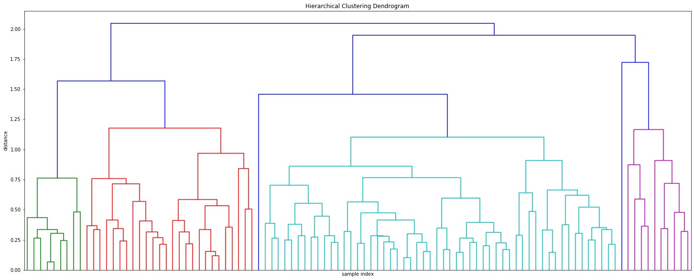


```python
plt.title('Hierarchical Clustering Dendrogram (truncated)')
plt.xlabel('sample index')
plt.ylabel('distance')
dendrogram(
    Z,
    truncate_mode='lastp',  # show only the last p merged clusters
    p=3,  # show only the last p merged clusters
    show_leaf_counts=False,  # otherwise numbers in brackets are counts
    show_contracted=True,  # to get a distribution impression in truncated branches
)
plt.show()
```


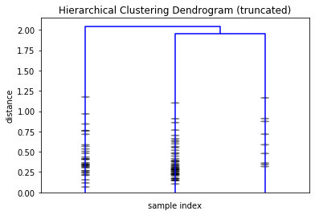


```python
#We use the MDS method to reduce the dimension of the distance matrix, and use different colors to represent the clustering results. 
seed = np.random.RandomState(seed=3)
mds = manifold.MDS(n_components=2, max_iter=3000, eps=1e-9, random_state=seed,
                n_jobs=1)
pos = mds.fit(a).embedding_
```


```python
k=3
clusters = fcluster(Z, k, criterion='maxclust')
plt.figure(figsize=(10, 8))
plt.scatter(pos[:,0], pos[:,1], c=clusters, cmap='prism')  # plot points with cluster dependent colors
plt.show()
```


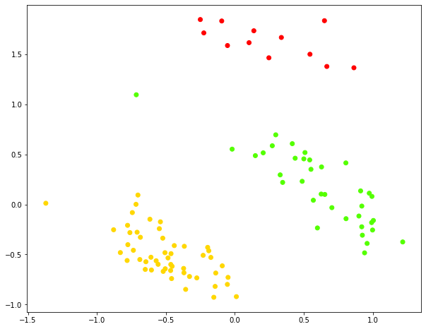


```python
b=b.copy()
b['cluster'] = clusters
b.groupby('cluster').mean()
```


<div>
<style scoped>
    .dataframe tbody tr th:only-of-type {
        vertical-align: middle;
    }

    .dataframe tbody tr th {
        vertical-align: top;
    }
    
    .dataframe thead th {
        text-align: right;
    }
</style>
<table border="1" class="dataframe">
  <thead>
    <tr style="text-align: right;">
      <th></th>
      <th>cnt</th>
      <th>latitude</th>
      <th>longitude</th>
      <th>elementary_school_count</th>
      <th>kindergarten_count</th>
      <th>university_count</th>
      <th>academy_ratio</th>
      <th>elderly_population_ratio</th>
      <th>elderly_alone_ratio</th>
      <th>nursing_home_count</th>
    </tr>
    <tr>
      <th>cluster</th>
      <th></th>
      <th></th>
      <th></th>
      <th></th>
      <th></th>
      <th></th>
      <th></th>
      <th></th>
      <th></th>
      <th></th>
    </tr>
  </thead>
  <tbody>
    <tr>
      <th>1</th>
      <td>16.166667</td>
      <td>36.474173</td>
      <td>127.457965</td>
      <td>76.000000</td>
      <td>135.166667</td>
      <td>4.916667</td>
      <td>1.912500</td>
      <td>12.203333</td>
      <td>5.425000</td>
      <td>1249.666667</td>
    </tr>
    <tr>
      <th>2</th>
      <td>4.098039</td>
      <td>37.150067</td>
      <td>127.067092</td>
      <td>29.098039</td>
      <td>43.843137</td>
      <td>1.980392</td>
      <td>1.483922</td>
      <td>15.057255</td>
      <td>6.333333</td>
      <td>664.137255</td>
    </tr>
    <tr>
      <th>3</th>
      <td>18.694444</td>
      <td>35.938680</td>
      <td>128.591659</td>
      <td>20.750000</td>
      <td>29.250000</td>
      <td>1.250000</td>
      <td>1.388611</td>
      <td>21.550556</td>
      <td>11.011111</td>
      <td>279.305556</td>
    </tr>
  </tbody>
</table>
</div>


**Conclusion:**

We use the MDS method to reduce the dimension of the distance matrix, and use different colors to represent the clustering results.
The figure above shows that the results is good.

The cities are divided into three different risk levels: high, middle, or low.

In the high risk level cities(cluster 3), the number of confirmed patients, the elderly_alone_ratio and the elderly_population_ratio
is the largest but the nursing_home_count and the academy_ratio is the smallest. It is very reasonable to classify the places with high number of diagnosed patients, serious aging, small number of nursing homes and people with low education level as high-risk areas.

In the mid risk level cities(cluster 1), although the number of confirmed patients is large, the nursing_home_count and
the academy_ratio are maximal and the elderly_population_ratio and the elderly_alone_ratio is minimal which means there are
more medical resources for every patient.

In the low risk level cities(cluster 2), the number of confirmed patients is fewest and the academy_ratio, elderly_population_ratio,
elderly_alone_ratio and nursing_home_count are all middle valuse.

If I were the policy maker, I would distribute more medical resources to cities with high level of risk, and send medical teams to assist high-risk cities.

## 3. Conclusion:

By analyzing these data of South Korea, I found COVID-19 is highly transmitted and people of all ages are easily infected. The main transmission route is contact transmission, so reducing aggregation and paying attention to wearing masks are good protective measures. At the same time, we should assist medical resources and send medical teams to high-risk areas to help them fight the epidemic together and overcome difficulties.
